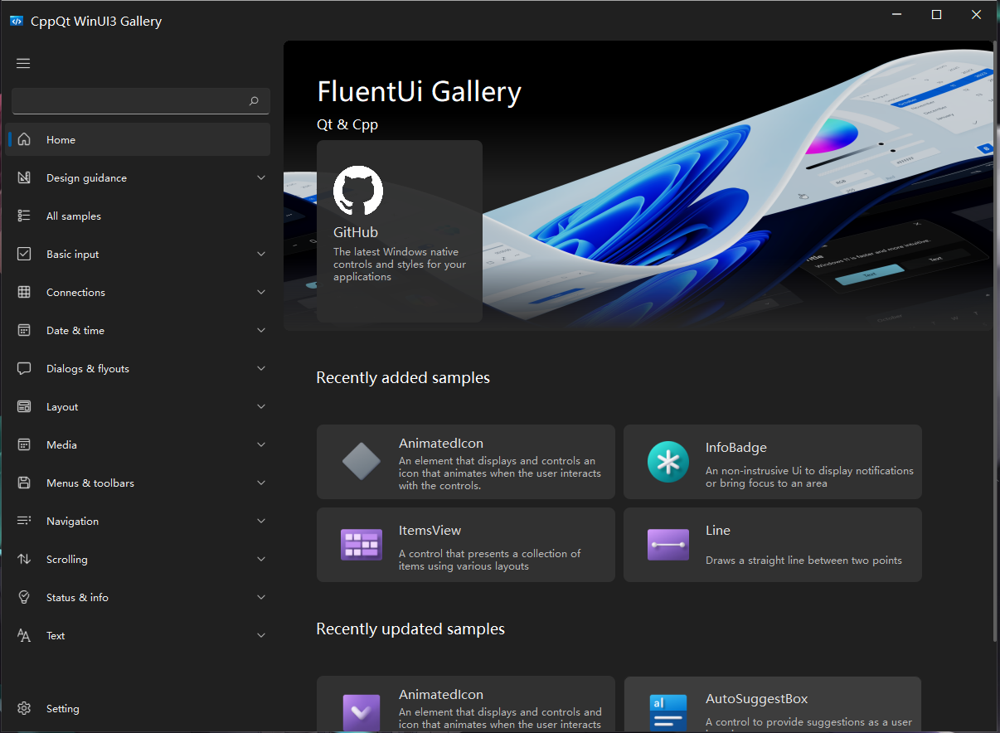

<h1 align="center">
  Cpp FluentUI 
</h1>

<p align="center">
  A fluent design component library for Qt Cpp.
</p>

<p align="center">
English | <a href="README_zh_CN.md">简体中文</a>
</p>

<div align=center>
  
</div>


## Requirements

+ Vs2022, Qt6.5.1

## Get started

### Build with Vs2022

* Clone the repository.

  ```SHELL
  git clone https://github.com/mowangshuying/CppQtFluentUi888.git
  ```

* Build

  >1.open CppQtFluentUi888.sln with Vs2022.
  >
  >2.build it!
  >
  >3.set start up project to FluWinGallery and run it!

### Build With Qt Creator

* Clone the repository

  ```shell
  git clone https://github.com/mowangshuying/CppQtFluentUi888.git
  ```

* Build

  > 1.Open CMakeLists.txt with Qt Creator.
  >
  > 2.build it!

##  Documentations

looking it at ./docs

## Refrence

+ [microsoft/WinUI-Gallery: This app demonstrates the controls available in WinUI and the Fluent Design System. (github.com)](https://github.com/microsoft/WinUI-Gallery)
+ [zhiyiYo/PyQt-Fluent-Widgets: A fluent design widgets library based on C++ Qt/PyQt/PySide. Make Qt Great Again. (github.com)](https://github.com/zhiyiYo/PyQt-Fluent-Widgets)
+ [Sepera-okeq/QtFluentWin11: Implementation of Fluent design for Qt! Support for Windows 11! In С++ (github.com)](https://github.com/Sepera-okeq/QtFluentWin11)
+ [zhuzichu520/FluentUI: FluentUI for QML (github.com)](https://github.com/zhuzichu520/FluentUI)

## Star History


